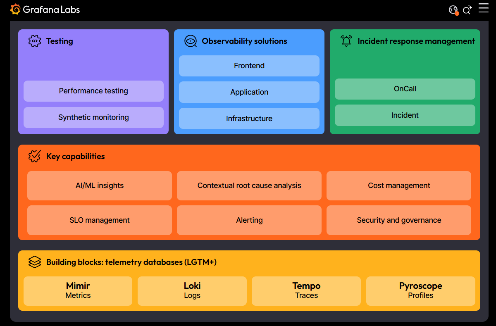

# Проект мониторинга и визуализации данных с Grafana



## Описание

`Grafana` — это мощный инструмент с открытым исходным кодом для визуализации и мониторинга данных.

Он позволяет создавать интерактивные и настраиваемые дашборды, которые могут отображать данные из различных источников в реальном времени.

Этот проект демонстрирует, как использовать `Grafana` для мониторинга производительности приложений и инфраструктуры.

## Основные возможности

- **Визуализация данных**: Поддержка различных типов визуализаций, таких как графики, гистограммы, таблицы и карты.
- **Интеграция с источниками данных**: Подключение к `Prometheus`, `InfluxDB`, `Elasticsearch`, `MySQL`, `PostgreSQL` и другим базам данных.
- **Создание дашбордов**: Возможность создания настраиваемых дашбордов, объединяющих данные из нескольких источников.
- **Алертинг**: Настройка оповещений на основе заданных условий.
- **Плагины и расширяемость**: Поддержка плагинов для расширения функциональности.
- **Многопользовательская среда**: Управление доступом и совместная работа над дашбордами.

## Установка и запуск

1. **Установите Grafana**:
   Скачайте и установите `Grafana` с [официального сайта](https://grafana.com/grafana/download)

2. **Запустите Grafana**:
   ```bash
   sudo systemctl start grafana-server
   sudo systemctl status grafana-server
   sudo systemctl enable grafana-server
   ```

3. **Доступ к Grafana:**
   
   Откройте браузер и перейдите по адресу `http://localhost:3000`
   
   Используйте `admin / admin` для входа в систему (не забудьте изменить пароль после первого входа).

## Настройка источников данных

1. **Добавьте источник данных:**
- Перейдите в `Configuration` ▶️ `Data Sources`
- Выберите источник данных, который вы хотите добавить (например, `Prometheus`).
- Введите URL и другие параметры подключения.

2. **Создайте дашборд:**
- Перейдите в `Create` ▶️ `Dashboard`
- Добавьте новую панель и выберите тип визуализации.
- Настройте запросы и параметры отображения данных.

## Примеры использования

1. **Мониторинг производительности:** Отслеживание метрик производительности серверов и приложений.
2. **Анализ бизнес-метрик:** Визуализация данных о продажах, пользователях и других бизнес-показателях.
3. **Отслеживание логов:** Анализ логов приложений для выявления ошибок и аномалий.

## Лицензия

Grafana распространяется под лицензией `Apache License 2.0.`

## Контакты

Если у вас есть вопросы или предложения, пожалуйста, свяжитесь с нами:

👨‍🏫 **Автор и научный руководитель:** Дуплей Максим Игоревич

📧 [Telegram](https://t.me/quadd4rv1n7) | [E-mail](malto::maksimqwe42@mail.ru)

📅 **Дата:** 06.03.2025

## Вклад в проект

Приветствуется вклад в развитие проекта. Если у вас есть идеи или вы хотите сообщить о баге, пожалуйста, создайте `Issue` или `Pull Request`

```
Grafana — это инструмент, который помогает вам видеть и понимать ваши данные. Начните использовать его прямо сейчас и улучшите процесс мониторинга и анализа.
```
