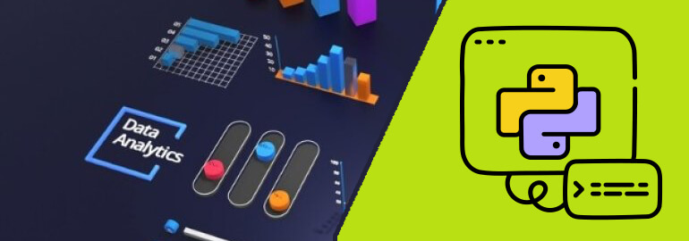

# 📊 Проект по анализу данных и машинному обучению 🤖

## Описание

Этот проект включает в себя использование различных инструментов и библиотек для анализа данных и машинного обучения.

Мы используем современные технологии для обработки и визуализации данных, а также для построения моделей глубокого обучения.

## Используемые технологии

1️⃣ **PyTorch** — это фреймворк для машинного и глубокого обучения.

2️⃣ **Tableau** — это мощный инструмент для создания интерактивных дашбордов и визуализаций.

3️⃣ **MongoDB** — это NoSQL база данных, предназначенная для работы с неструктурированными или полуструктурированными данными.

4️⃣ **Hadoop** — это экосистема для хранения и обработки больших данных.

5️⃣ **TensorFlow** — это библиотека от Google для построения моделей глубокого обучения.

6️⃣ **Keras** — это высокоуровневая библиотека для работы с нейронными сетями.

7️⃣ **NumPy** — это библиотека Python для научных вычислений.

8️⃣ **Dask** — это инструмент для масштабирования анализа данных.

9️⃣ **Grafana** - это мощный инструмент с открытым исходным кодом для визуализации и мониторинга данных.

Он позволяет создавать интерактивные и настраиваемые дашборды, которые могут отображать данные из различных источников в реальном времени.

---

📅 **Дата:** 06.03.2025

👨‍🏫 **Автор и научный руководитель:** Дуплей Максим Игоревич

📧 **Контакт:** [Telegram](https://t.me/quadd4rv1n7) | [E-mail](malto::maksimqwe42@mail.ru)
